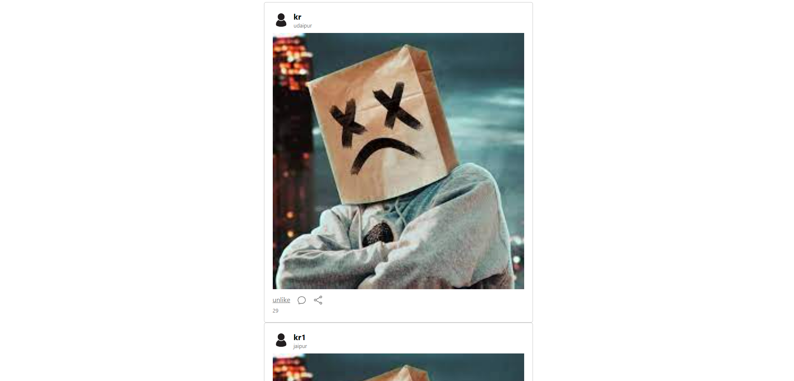
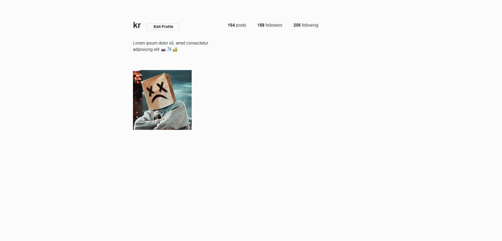

# socialMediaPost
This is a small ASP.NET project in which Instagram-like posts can be posted on the website and these photos will be visible to all other website uers and will be avalible in the profile.
The follow and the following count are static.
### post page

### profile page

